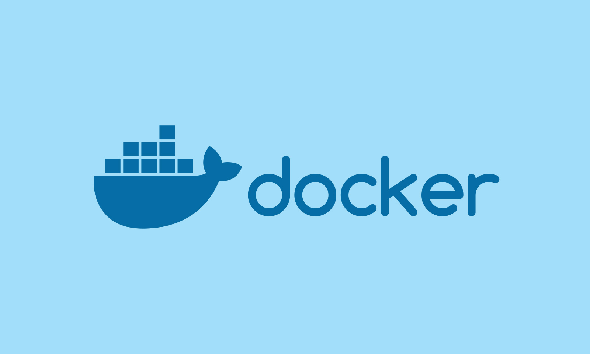
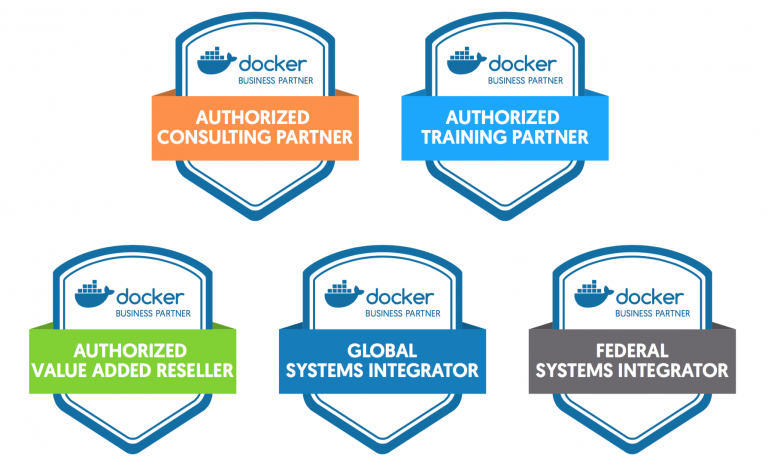

<h2 align="center">Docker Course - Learn Docker &nbsp;:heart:&nbsp;</h2>



## ¿Que es Docker? 

Docker es un proyecto de código abierto que automatiza el despliegue de aplicaciones dentro de contenedores de software, proporcionando una capa adicional de abstracción y automatización de virtualización de aplicaciones en múltiples sistemas operativos. Docker utiliza características de aislamiento de recursos del kernel Linux, tales como cgroups y espacios de nombres (namespaces) para permitir que "contenedores" independientes se ejecuten dentro de una sola instancia de Linux, evitando la sobrecarga de iniciar y mantener máquinas virtuales.


## Historia 
Solomon Hykes comenzó Docker como un proyecto interno dentro dotCloud, empresa enfocado a una plataforma como un servicio (PaaS), con las contribuciones iniciales de otros ingenieros de dotCloud, incluyendo Andrea Luzzardi y Francois-Xavier Bourlet. Jeff Lindsay también participó como colaborador independiente. Docker representa una evolución de la tecnología patentada de dotCloud, que es a su vez construida sobre proyectos de código abierto anteriores como Cloudlets.

Docker fue liberado como código abierto en marzo de 2013. El 13 de marzo de 2014, con el lanzamiento de la versión 0.9, Docker dejó de utilizar LXC como el entorno de ejecución por defecto y lo reemplazó con su propia biblioteca, libcontainer, escrito en Go. El 13 de abril de 2015, el proyecto tenía más de 20 700 estrellas de GitHub (haciéndolo uno de los proyectos con más estrellas de GitHub, en 20ª posición), más de 4 700 bifurcaciones (forks), y casi 900 colaboradores.

Un análisis en 2018 mostró las siguientes organizaciones como las principales contribuyentes de Docker: Red Hat (mayores contribuyentes, aún más que el equipo de Docker en sí), el equipo de Docker, Microsoft, IBM, Google, Cisco Systems y Amadeus IT Group.34 [WIKIPEDIA](https://es.wikipedia.org/wiki/Docker_(software)).<br>

📦 [Install Docker - Windows ](https://www.docker.com/products/docker-desktop) Instalador de Docker.<br>

## Comandos

```
docker version
```
```
docker -v
```
```
docker info
```
```
docker --help
```
```
docker login
```
```
docker images
```
```
docker pull
```
```
docker rmi
```
```
docker ps-a
```
```
docker images
```
```
docker rm
```

## Ventajas de los contenedores Docker

- Modularidad
- Control de versiones de imágenes y capas
- Restauración
- Implementación rápida


## ¿Hay limitaciones para el uso de Docker?

En sí mismo, Docker es una excelente herramienta para la gestión de contenedores individuales. Al comenzar a utilizar cada vez más contenedores y aplicaciones en contenedores, divididas en cientos de piezas, la gestión y la organización se pueden tornar muy difíciles. Finalmente, debe retroceder y agrupar los contenedores para ofrecer servicios, como redes, seguridad, telemetría, etc., en todos sus contenedores. Es aquí donde aparece Kubernetes.




